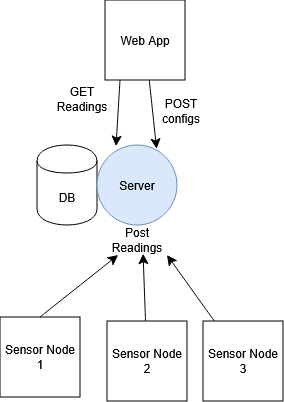
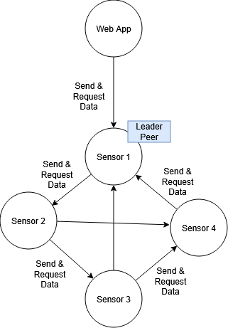

# Exercise 04 Architechture Patterns 
## Team 
Simone Feldbacher, Florian Neugebauer

# System 
Pflanzenmonitoring mit mehreren Sensor Modulen. Daten sollen in einer Web App dargestellt werden. Wenn daten einen kritischen Wert erreichen soll eine Notification gesendet werden. Configs wie Polling time sollen für alle Sensoren gesetzt werden können. 

### 1. Client-Server 

Characteristika:
- Zentrale Datenverarbeitung
- Geringe Komplexität
- Einfache Visualisierung über Web-Client

Abhängigkeit vom Server
### 2. Peer-to-Peer 
Jede Node kann Daten senden und empfangen. Die Sensoren sind wie in einem Mesh untereinander verbunden. Die Daten gleichen sich mit der Zeit ab. Die Web app kommunizeirt mit einer Node. Falls diese nicht mehr verfügbar ist sucht sie eine neue. Wenn eine Node einen Kritischen Wert beobachtet soll sie kommunikation mit der Web-App auslösen, welche push Benachrichtigungen senden kann. 

Charakteristika:

- Dezentrale Kommunikation ohne zentrale Instanz
- Hohe Ausfallsicherheit durch Mesh- oder Gossip-basierte Verteilung
- Komplexere Datenhaltung und Synchronisation
- Web-App bezieht Daten von verfügbaren Peers
- für übertragungsprotokolle mit geringer reichweite, größere distanzen können mit genügend peers überwunden werden